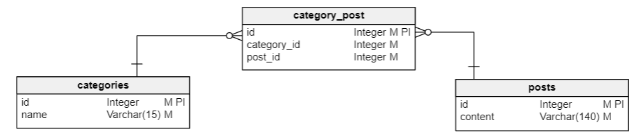
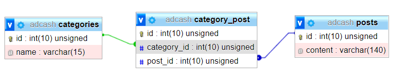

# Adcash assignment
### Technologies
- Laravel 8
- Vue 3
- Typescript

### Libraries
- https://github.com/vueform/multiselect
- https://kazupon.github.io/vue-i18n/
- And others...

### Database
**Many to many relationship**, because a post may belong to one or more categories




### Tests
View/component tests are in tests/unit folder

# adcash_frontend

## Project setup
```
npm install
```

### Compiles and hot-reloads for development
```
npm run serve
```

### Compiles and minifies for production
```
npm run build
```

### Run your unit tests
```
npm run test:unit
```

### Lints and fixes files
```
npm run lint
```

### Customize configuration
See [Configuration Reference](https://cli.vuejs.org/config/).
